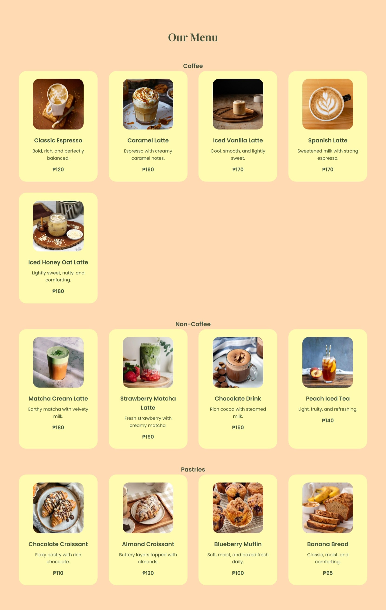

# Cozy Cup Cafe
## Project Description 
Cozy Cup Cafe is a tiny cafe which concept is designed to give a warm, relaxing, and welcoming space where customers can enjoy quality coffee, light snacks, and a comfortable ambience. 
## Features
* Comfortable seating with a warm, cozy ambience.
* Quality coffee and simple beverages.
* Light snacks and pastries.
* Free Wi-Fi for studying or working.
* Friendly and welcoming service. 
## Screen Captures
### Capture 1
 
In here is the logo of Cozy Cup Cafe, along with the buttons Home, Menu, About us, and Contact. 

### Capture 2

This area is where you'll explore the menu. 

### Capture 3

This is the Cafe's information. 

### Capture 4

This is how our customers reach out to us. 
___
# About the Authors

**Name**: Juliet Lou T. Tumalac 
**Email**: jlouliwanag@gmail.com

  
  

**Name**: Maverick Miguel A. Torres 
**Email**: mabbytorres03@gmail.com

  

